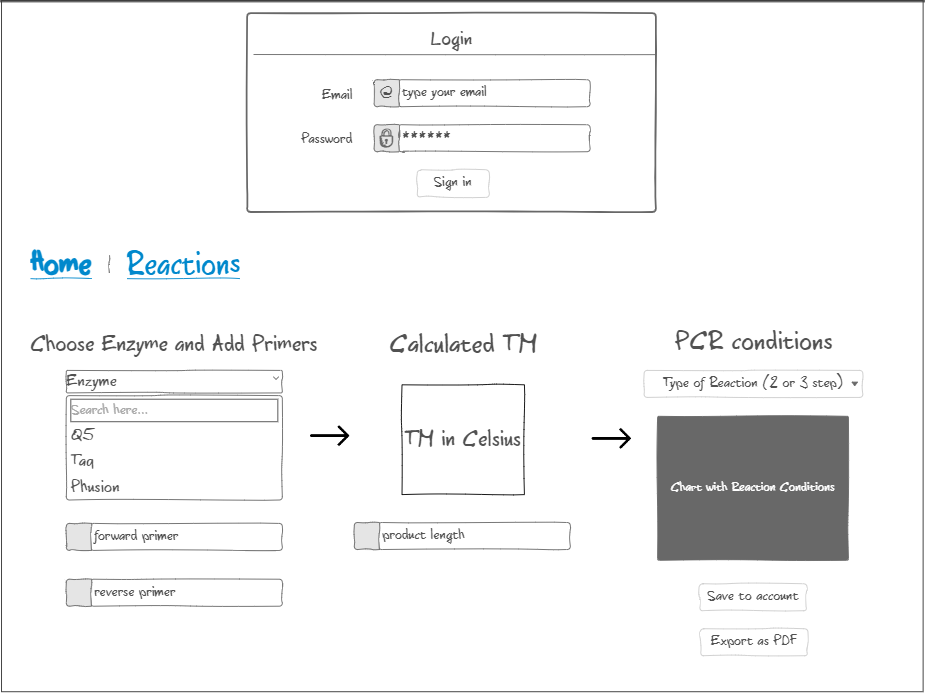
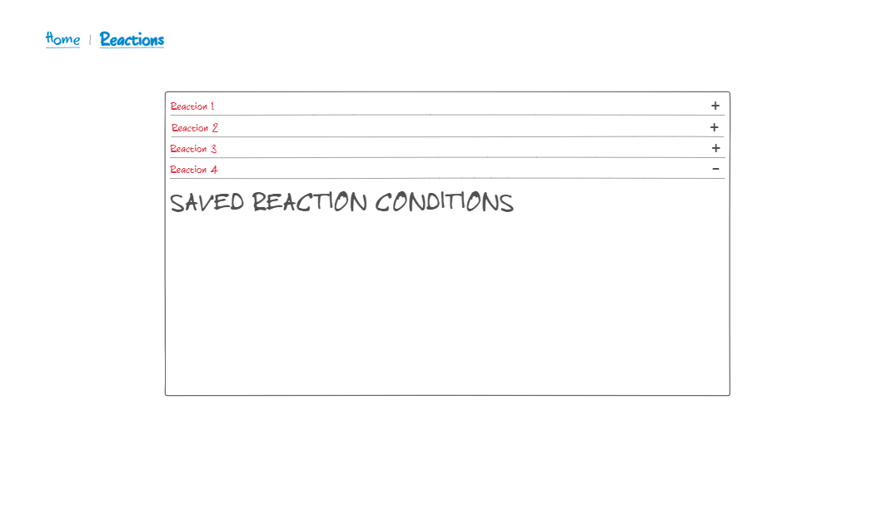

## [Class Notes](notes/notes.md)

# benchrat
Startup Application for CS 260

## Description Deliverable

### Elevator Pitch

Sick of flipping between 10 different applications for designing bio labs PCR primers and reactions? This application will combine these multiple calculators and necessary enzyme conditions into one handy place. All you need to enter are your prospective primers, the length of your product, and your polymerase, then your required 2-step and 3-step PCR conditions will automatically be computed. You can then save these conditions in your user account and send them to others.

### Design
Home page designed with login and ability to enter pcr primers to get your reaction conditions

Reaction page shows previously computed conditions

### Key Features

- Ability to create a secure login over HTTPS
- User input for forward and reverse primers as well as product length and 2 different polymerases (Q5 and Taq)
- PCR calculations:
    + Annealing temperatures for forward and reverse primers displayed
    + 2-step and 3-step reaction conditions displayed
- Saving these calculations under the reaction name associated with the user's account
- Selectable calculations that can be exported as a cvs or pdf files

### Technologies

I am going to use the required technologies in the following ways.

- **HTML** - Uses correct HTML structure for application. Three HTML pages. One for the login, another for inputing the reaction conditions, and another for selecting and exporting saved reactions.
- **CSS** - Application styling that looks good on different screen sizes, uses good whitespace, color choice and contrast.
- **JavaScript** - Provides login, choice display, applying votes, display other users votes, backend endpoint calls.
- **Service** - Backend service with endpoints for:
  - login
  - submitting primers and reaction name
  - retrieving saved primers and reaction conditions
- **DB/Login** - Store users, primers, and conditions in database. Register and login users. Credentials securely stored in database.
- **WebSocket** - As the user enters a primer, the annealing temperature is changed and displayed before being saved.
- **React** - Application ported to use the React web framework.

## HTML deliverable

### For this deliverable I built out the structure of my application using HTML.

  **HTML pages** - Four HTML pages that represent the ability to login, to calculate annealing temperatures and reaction conditions, to save the reactions and primers, and another page to teach users about the tool
  **Links** - Every page links to every other through a consistent nav element
  **Text** - Reaction conditions are represented by text
  **Images** - There is an avatar image for the login screen and a rat image for decoration of every page
  **DB/Login** - Input boxes for PCR names and primers with the ability to save the calculations and access them when saved by the user
  **WebSocket** - As sequences are added to the primer input field, the TM will automatically update